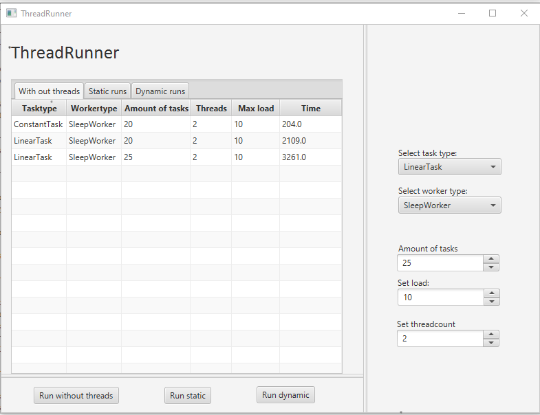
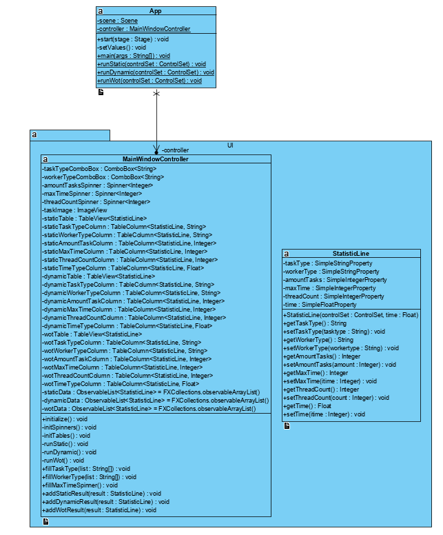
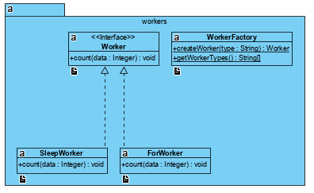
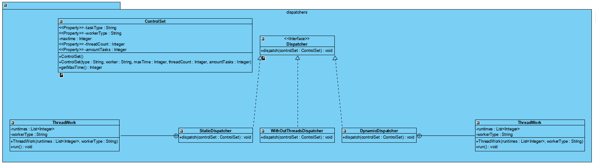

# ThreadRunner

## Hajautetut järjestelmät: Harjoitustyö 1 tehtävänanto
Ensimmäisessä työssä harjoitellaan säikeiden luontia ja tehtävien jakamista niille. Lisäksi tutkitaan, miten tehtävien suoritusajat vaihtelevat erilaisilla tehtävätyypeillä. Harjoitus pohjautuu valmiiseen ohjelmarunkoon, johon ryhmän tehtävänä on täydentää puuttuvat osat. ThreadRunner-ohjelma käyttää JavaFx-ympäristöä graafisen käyttöliittymänsä toteutukseen. Harjoitustyön tekemiseen ei kuitenkaan tarvita JavaFx-osaamista.

## Ohjelman käyttöliittymä

- Select task type: Tällä valinnalla asetetaan tehtävän datajoukon tyyppi. 

- Select worker type: Asettaa käytettävän tehtävän tyypin.

- Amount of tasks: Säikeissä ajattavien tehtävien määrä.

- Set load: Säätää yksittäisen tehtävän suoritusaikaa. 

- Set threadcount: Asettaa tehtävässä käytettävien säikeiden määrän. Valikon maksimiarvoksi tulee automaattisesti käytössä olevien ytimien määrää vastaava arvo. Oletusarvona on kaksi, joka on virtuaalikoneen oletusprosessorimäärä.

- Run without threads: Käynnistää tehtävän suorituksen jakamatta tehtävää useille säikeille. Tämä on tehtäväpohjassa toteutettu ja toimii esimerkkinä.

- Run static: Käynnistää tehtävän suorituksen staattisella tehtäväjaolla. Tämä toteutetaan tehtävässä 1.

- Run dynamic: Käynnistää suorituksen dynaamisella tehtäväjaolla. Tämä toteutetaan tehtävässä 2.

## Ohjelman rakenteen kuvaus

### App.java ja fi.utu.tech.UI-pakkaus

`App` on ohjelman pääluokka, joka sisältää main-metodin. Se sisältää myös ajojen käynnistykseen ja suoritusajan mittaamiseen käytetyt metodit. Pakkaus `fi.utu.tech.UI` sisältää graafiseen käyttöliitymän toimintaan liittyvät luokat. **Tätä pakettia ja luokkaa ei tule/tarvitse muuttaa tehtäviä tehdessä.**

### fi.utu.tech.tasks

Tehtävälistojen generointi. Pakkauksesta löytyy erityyppisiä tehtävälistoja generoivia luokkia.
**Tätä pakettia ja sen luokkia ei tule/tarvitse muuttaa tehtäviä tehdessä.**

### fi.utu.tech.workers

Tästä pakkauksesta löytyvät säikeissä suoritettavat työt. 

**Tätä pakettia ja sen luokkia ei tule/tarvitse muuttaa tehtäviä tehdessä.**

### fi.utu.tech.dispatchers

`fi.utu.tech.dispatchers`-pakkaus sisältää töiden säikeille jakamiseen liittyvät toiminteet.

Tämä pakkaus on harjoitustyön suorittamisen kannalta tärkein. Täältä löytyvät ne luokat, `StaticDispatcher` ja `DynamicDispatcher`, joissa tehtävissä 1 ja 2 vaaditut töiden jaot säikeille suoritetaan.

## Tehtävät

### Tehtävä 1. Staattinen tehtävänjako

Ensimmäisessä tehtävässä toteutetaan töiden jako säikeille niin, että jokainen säie saa suoritettavakseen **kiinteän** määrän tehtäviä. Säikeitä luodaan pyydetty määrä ja niistä jokaiselle annetaan **yhtä suuri** osa generoidusta tehtävälistasta suoritettavaksi (mahdollisuuksien puitteissa). 

Tehtävä ovat kokonaislukumuotoisessa `ArrayList`-tietorakenteessa, jonka voi jakaa säiemäärää vastaaviin osiin. 

Säikein suoritamien tehtävien suoritusajat vaihtelevat ja säikeet saavat työnsä valmiiksi eri aikoihin. Staattisessa jaossa nopeammin valmistuvat säikeet jäävät odottamaan muiden valmistumista, eikä jäljellä olevia tehtäviä jaeta uudelleen jo valmistuneille säikeille.

### Tehtävä 2. Dynaaminen tehtävänjako

Tehtävässä kaksi säikeet suorittavat työtä kuten tehtävässä yksi, mutta nyt työ jaetaan eri tavalla. 

Tarkoituksena on toteuttaa jako niin, että kaikille säikeille riittää suoritettavaa, eivätkä nopeammin valmistuvat säikeet odota hitaampia tekemättä mitään. 

Tämä toteutetaan jakamalla saatu tehtäväjoukko huomattavasti säikeiden määrään **suurempaan** määrään osajoukkoja, esimerkiksi 10 kertaa säikeiden määrä. Jokaisen ajettava säie poimii tästä osajoukkojen joukosta itselleen tehtäväjoukkoja niin kauan kuin niitä riittää. 
Toisin sanoen aina kun yksi laskenta valmistuu, säie saa uuden tehtävän jonosta.
